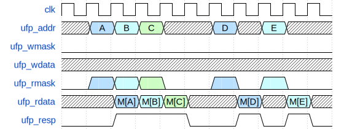
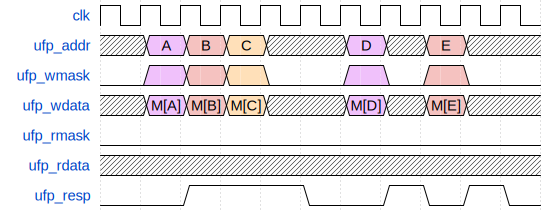
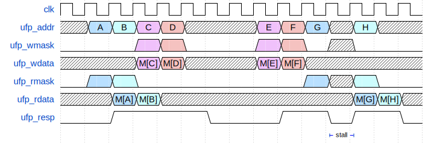
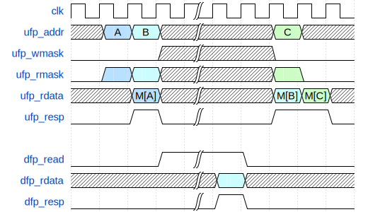
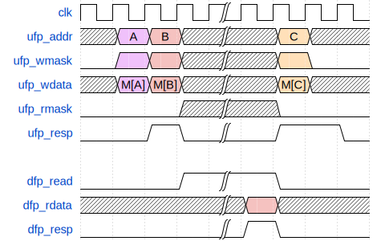
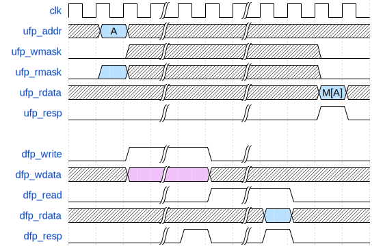
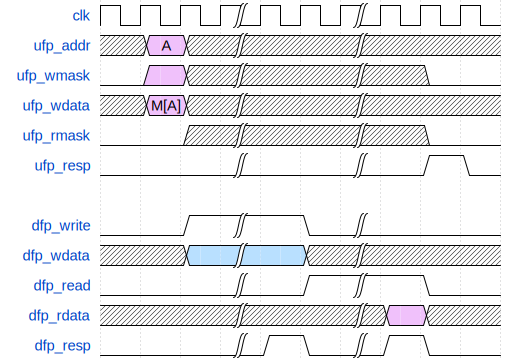

# ECE 411: mp_cache_pp README

## Pipelined 4-Way Set-Associative Cache

**This document highlights the differences in specifications for
the pipelined version of this cache. For a more comprehensive summary 
of this version, see [GUIDE_PP.md](./GUIDE_PP.md)**

# Design Specifications

- 2-stage pipelined:
  - 1 cycle latency in response on cache hits
  - 1 access per cycle throughput on cache hits

# Cache Timing Requirements

The cache must obey the following timing requirements:

## Hits

  
Read hit timing diagram
 

  
Write hit timing diagram
 

  
Mixed hit timing diagram
 

## Clean Misses

  
Read with clean miss timing diagram
 

  
Write with clean miss timing diagram
 

## Dirty Misses

  
Read with dirty miss timing diagram
 

  
Write with dirty miss timing diagram
 

# Grading

## Submission
You will be graded on the files on the `cache_pp` branch in your class GitHub repository on the specified deadline.
