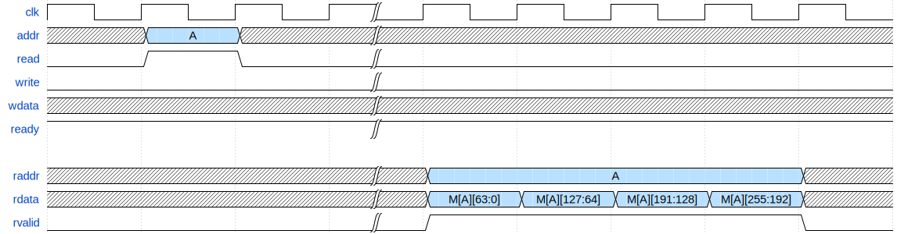
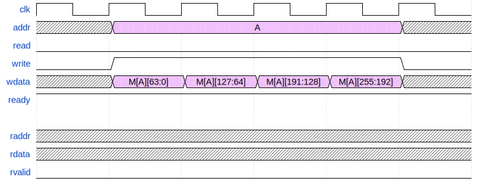
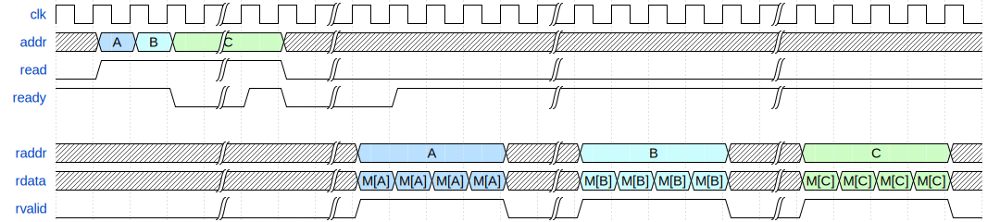
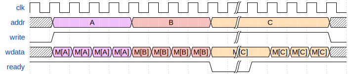
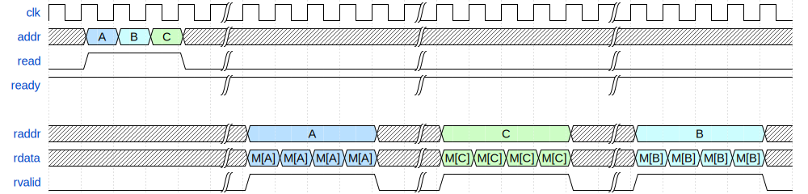
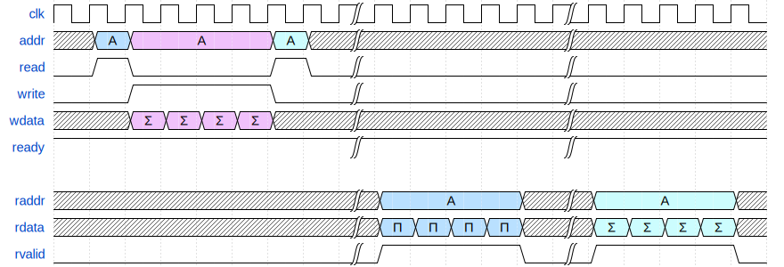

# ECE 411: mp_ooo

This document, README.md, forms the specification for the machine problem. For
more details and documentation, visit the `docs` folder. Inside, you will find:

- [GUIDE.md](./docs/GUIDE.md): Some tips and resources for this MP.
- [WHAT_IS_AN_OOO.md](./docs/WHAT_IS_AN_OOO.md): Basic overview of an OoO
  processor.
- [ADVANCED_FEATURES.md](./docs/ADVANCED_FEATURES.md): List of potential
  advanced features and related advice.
- [VERILATOR.md](./docs/VERILATOR.md): About the Verilator simulation toolchain.

# Introduction

This machine problem involves the design of an out-of-order microprocessor. You
are required to implement the RV32IM instruction set (with the
exception of the `FENCE*`, `ECALL`, `EBREAK`, and `CSRR` instructions). This handout is an incomplete
specification to get you started with your design.

## Point Breakdown

| Checkpoint          | Points |
|---------------------|--------|
| CP 1                | 15     |
| CP 2                | 25     |
| CP 3                | 25     |
| Advanced Features   | 25     |
| Presentation/Report | 10     |

**Total Points:** 100

Detailed rubrics for each checkpoint will be added below closer to their release
date.

Students can also score up to 10 points of extra credit by making additional
advanced features - more about this will be announced as we approach the
Advanced Features phase of `mp_ooo`. The maximum possible grade on this MP will
be *110 points*.

## Overview

By the end of this MP, you will make an out-of-order processor implementing:

- Either Tomasulo's Algorithm or an Explicit Register Renaming scheme
- Split instruction cache and data cache
- Support for multiplication and division instructions
- Advanced features of your choice

In total, this MP will span 8 weeks. In the first five weeks, you will
develop the core microarchitecture for an RV32IM OoO processor. By
Week 2, you will pick either a Tomasulo-style or ERR-style processor.
Your group will be assigned a mentor CA/TA that has worked with that
microarchitecture in the past. They will be your primary source of
guidance throughout this MP, and will also be responsible for grading
your submissions. You will have weekly meetings to discuss your
progress on the MP and grade your checkpoints.

The two weeks after will be for Advanced Features, where you improve the
performance of your baseline RV32IM processor on a set of staff-provided
benchmarks. Your goal will be to outperform a fixed set of performance targets
and baseline processors. Unlike prior semesters of ECE 411, **you will not be
graded relative to your peers' submissions**.

During this time, there will be a Design Competition run in parallel.  Course
staff will maintain a "Leaderboard", which periodically runs various benchmarks
using your processor. You will be ranked against your classmates' processors, as
well as some staff-provided baselines.  While this will not impact your grade,
there are prizes up for grabs provided by our sponsor, Optiver!

## mp_cache Dependency

Checkpoints 1 and 3 of this MP involve integrating instruction and data caches
with your processor - typically, this is done by using modified versions of
`mp_cache`.

If all members in your group were unable to complete `mp_cache`, don't
worry - we provide the RTL for a direct-mapped write-through cache.
However, this cache will be less performant and area/energy-efficient
than `mp_cache`. We highly recommend attempting to complete your
`mp_cache` submission.

## Outside Code

For this MP, all the RTL/code that you use should be your own, with the
exception of staff-provided resources. In addition, you may use any IPs
categorized under `Datapath: Arithmetic Components`, `Datapath: Floating Point`,
and `Datapath: Sequential Components` as categorized by [the DesignWare
docs](https://www.synopsys.com/dw/buildingblock.php). The most relevant IPs for
implementing RISC-V extensions will be:

- Multiplier
- Divider
- Relevant functional units in `Datapath: Floating Point`

Use of other outside RTL/code is prohibited.

# Checkpoints

This MP is split into 3 mandatory checkpoints, and a final evaluation after the
advanced features stage.

## Submissions

You will be graded by your mentor during your weekly meetings. For Checkpoints 1
& 2, you will be manually graded on a commit of your choice. This commit should
be pushed to GitHub before the stated deadline on each checkpoint. For
Checkpoint 3 onwards, you will be evaluated by an autograder, and standard MP
policy will apply.

With each checkpoint, you will submit a progress report. This should
discuss the progress your team made, important design decisions,
relevant performance metrics, etc. This will serve as a way for your
mentors to keep track of your design process, and provides material
for your final report and presentation.

Though it is 8 weeks long, `mp_ooo` is a fast-paced MP with heavy dependencies
between checkpoints. It is in your best interest to start early and stay synced
with your mentor.

## Late Policy

Each checkpoint will be graded with the standard late policy shown on [the class
website](https://courses.grainger.illinois.edu/ece411/sp2025/policy.html). Unlike
prior MPs, there will be **no "late voucher"** system available for checkpoints.

There will be no partial credit awarded beyond what is outlined in the rubrics below.

## Checkpoint 1 (15 points)

**_Due 3/28, 11:59PM_**

In this checkpoint, you will be designing the high-level microarchitecture for
your processor, creating the front-end fetch stage, attaching an instruction
cache, and integrating it with a DRAM model. At this time, you should also
decide whether you will be developing a Tomasulo-style or ERR-style
microarchitecture.

Unlike `mp_pipeline`, your fetch stage should also contain a linebuffer that
fulfills the following criteria:
- When fetching an instruction from a new cacheline, you will make a request
  from the cache. 
- The cache will return the entire cacheline, which you will store in
  a linebuffer (256-bit register storing a single cacheline).
- If the next instruction fetch is from the same cacheline, you will
  get it directly from the linebuffer.
This linebuffer-based design is used to avoid `mp_cache`'s issue of 
only being able to respond every other cycle.

**Requirements:**
- Draw a design block diagram (using draw.io or similar, **not handwritten!**)
  of your OoO datapath [5]
  - Graded on completeness, state/information flow, and readability
- Implement and test a parameterizable queue (depth and width) [3]
  - You are expected to identify relevant edge-cases of a FIFO, and show your
    tests for them
- Implement and test a cacheline adapter to deserialize a burst out of the DRAM
  model, and integrate this with your cache. [3]
- Implement instruction fetch, integrate it with your cache, and feed fetched
  intructions into your queue [4]
    - Your program counter should be initialized to `0xAAAAA000`

## Checkpoint 2 (25 points)

**_Due 4/11, 11:59PM_**

By the end of this checkpoint, your processor must be able to execute all
immediate and register instructions in the RV32I spec. In addition, you will be
responsible for integrating multiplier and divider IPs from Synopsys to implement the
RISC-V M extension.

You will need to handle the DIV-0 edge case - check the RV32 ISA spec to
understand the expected behavior.

**Requirements (Tentative)**
- Implement your OoO architecture such that it can execute all immediate and
  register instructions in RV32I
  - `AUIPC` is *optional* for this checkpoint
- Integrate the multiplier IP with your processor to perform all `MUL`
  instructions in RV32M
- Integrate the divider IP with your processor to perform all `DIV`/`REM`
  instructions in RV32M
- Modify your `mp_verif` random testbench to test coverage on all the
  instructions required for this CP
- Demonstrate that your processor is able to execute instructions out-of-order
  (via `testcode/ooo_test.s`)
- Show that your processor is compliant with the Spyglass linter

*There will be no provided tests outside of `ooo_test.s`* - if you are unable to
correctly modify the random testbench, you must demonstrate
correctness by writing your own comprehensive tests.

## Checkpoint 3 (20 points)

**Due: 4/25, 11:59PM**

By the end of this checkpoint, your processor must be able to execute the
entirety of the RV32IM spec (barring the exceptions outlined
[here](./#Introduction)). You will also integrate data and instruction
caches with your processor, and add necessary arbitration logic for accessing the DRAM model.

Deliverables for this checkpoint are:

- Integrate the data cache with your core
  - Add any necessary write/arbiter logic to the cacheline adapter
- Support all memory instructions
  - Memory instructions can be performed in order on ROB commit
  - Recommended to support loads before ROB commit (refer to lab)
- Support all control instructions (`BR`, `JAL`, `JALR`) and `AUIPC` if not yet
  implemented
  - Not required to support branch prediction yet, static taken or not-taken is okay

This will be the first checkpoint graded by an autograder. In the meantime, you
can use random/targeted tests, `coremark_im`, and any other released tests in
order to test your processor. Additionally, there will be no partial credit for
this checkpoint - you will receive credit for each benchmark you complete
correctly. More information TBD.

## Advanced Features (25)

**Due: 5/9, 11:59PM**

This is the fun part of `mp_ooo` - optimizing your processor! You will be
implementing processor enhancements of your choice. A list of example advanced
features and their associated point values can be found in
[ADVANCED_FEATURES.md](./docs/ADVANCED_FEATURES.md). Some of these features
require significant design considerations when constructing the core
microarchitecture, so be sure to take a look at this early on in your design
process.

This portion of your grade has two parts: implementing advanced
features of your choice, and evaluating performance relative to a
set of baseline metrics on staff-selected benchmarks.

The initial benchmark suite and the related performance metrics will be
announced on the first day of Advanced Features (4/25).

Note that you will need to justify your advanced feature selections during your
final report, and include quantitative analyses of the performance
benefit/degradation caused by each advanced feature. *This is required to score
any points for a feature*.

### Leaderboard
The leaderboard, like the autograder for past MPs, will run periodically and test a series
of benchmarks on your processor. If a benchmark is found to run correctly, then
the Leaderboard will assign a nonzero score based on staff-picked metrics.
Coremark is confirmed to be in this test suite, and you will receive copies of
any additional "open" benchmarks when the leaderboard is first deployed.

To show up on the leaderboard, your processor must:
- Be connected to RVFI
- Match Spike and RVFI on **each test case (no points for a testcase you don't match)**
- Be synthesizable and meet timing at the frequency you specify in `options.json`

Note that not all leaderboard benchmarks will be public. Staff will curate a
series of "closed" benchmarks that will not be distributed as part of the
`mp_ooo` release.

## Presentation & Final Report (10 Points)

You will submit a final report detailing your processor architecture and design
choices made throughout the MP, as well as performance metrics for the various
features and configurations you implemented. In addition, you will prepare a
brief presentation to give to course staff about your processor.

Presentations will happen during finals week by appointment with course
staff. Your final report will be due on **5/17** at midnight.

## Group Evaluations

At the end of the project, each group member will submit feedback on how well
the group worked together and how each member contributed to the project. The
evaluation, along with feedback provided at TA meetings throughout the semester,
will be used to judge individual contribution to the project.

Although the group evaluation occurs at the end of the project, this should not
be the first time your mentor TA hears about problems that might be
occurring. If there are major problems with collaboration, the problems should
be reflected in your TA meetings, or in private communication with your TA. The
responses on the group evaluation should not come as a surprise to anyone.

In the event of significant to extreme imbalance in work distribution between
team members, course staff reserves the right to apply corrective bonuses and
penalties to the affected students. This will be done only on a case-by-case
basis.

# Memory Model

Also called the DRAM model, you will use a banked burst memory model throughout
this MP.  Unlike previous memory models used throughout the semester, this model
supports **multiple outstanding requests**. This means you can send multiple
requests before the first response comes back from memory. Furthermore, if you
issue multiple read requests, they might come back in a different order than you
sent the requests. Conflicting writes will **not** be handled out of order.

You are free to use this feature or not at your discretion. It may help
performance significantly when paired with other advanced features. If you
prefer, you can ignore this feature and use it very similarly to previous memory
models which only supported one outstanding request.

  
Single Read Request
 

  
Single Write Request
 

  
Read Queue Full
 

  
Write Queue Full
 

  
Out-Of-Order Read Response
 

  
Mixed Reads and Writes to the Same Destination
 

# Teamwork

As mentioned earlier, it is crucial in `mp_ooo` that you split work in a
sensible manner across your team. Frequent communication with your groupmates
and your mentor are key to ensuring that this is done in a reasonable manner.

In the event that a groupmate is unresponsive or not contributing their fair
share, it is important that you address this with relative haste. Pushing this
off until group evaluations makes it harder for us as a course staff to deal
with such issues. Ensure that you take the following actions:

1. Report to your mentor as early as possible if someone in your team has
   stopped responding or isn't contributing any (non-trivial) work.
2. Document all evidence, such as chat logs, repo commit histories, etc. of
   their lack of contribution and due diligence.
3. Be explicit in your progress reports about what was and wasn't done as a
   group, and any important individual contributions.

Team members who under-contribute or contribute nothing will lose part or all
(100%) of their final `mp_ooo` grade, depending on severity. These points may be
reallocated/awarded to other groupmates who had to over-contribute as a result.
